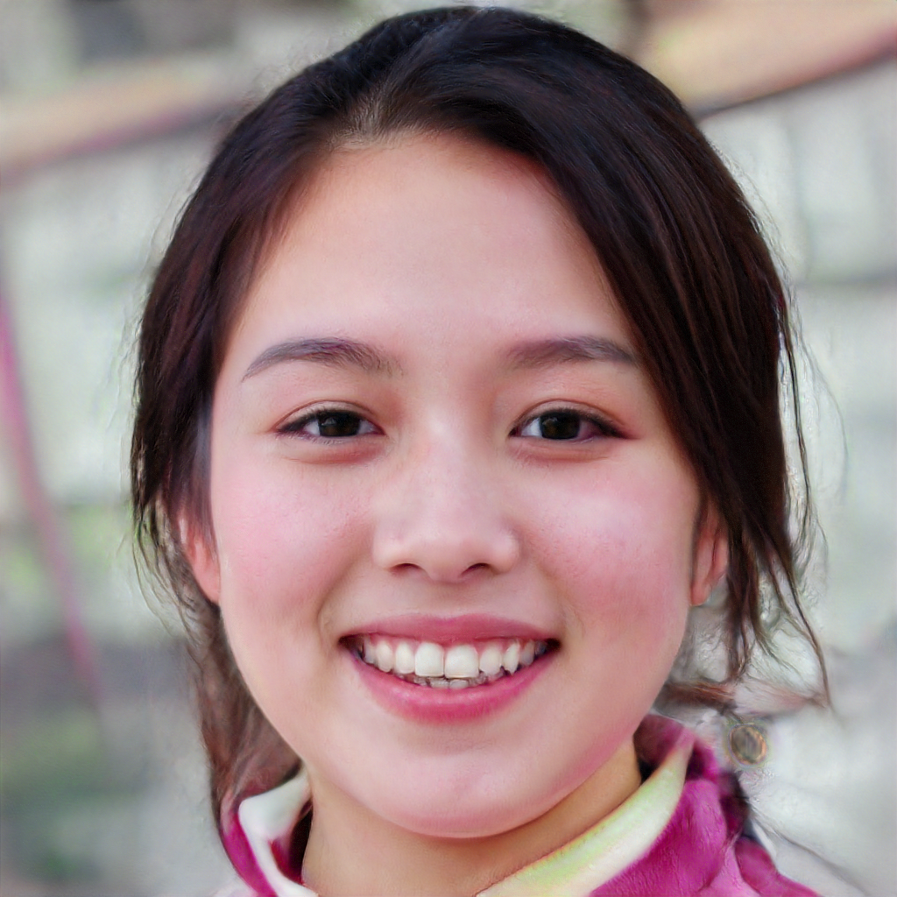
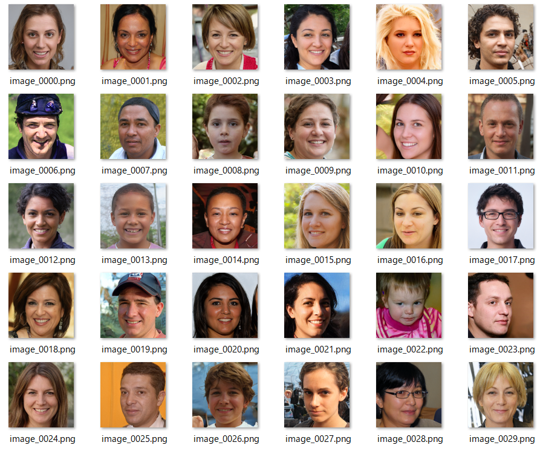

# stylegan_app


## It can run on windows 10  
## You don't need python or tensorflow.  
I am using this one: https://github.com/podgorskiy/StyleGANCpp  
Excellent!I've made [StyleGANCpp](https://github.com/podgorskiy/StyleGANCpp) a little easier to use.    

Overwrite the main.cpp in this repository with the main.cpp in [StyleGANCpp](https://github.com/podgorskiy/StyleGANCpp)  and build it.   

---

- Generate various faces by changing the seed

```
.\bin\stylegan.exe --seed 841
```



- Generate various faces by changing the psi

```
.\bin\stylegan.exe --seed 841 --psi 0.3
```


- Smoothly move through psi  

```.\bin\stylegan.exe --seed 841 --smooth_psi 1 --num 10```


- Randomly generate faces.  

```.\bin\stylegan.exe --random_seed 1 --num 30```  



- Smoothly change latent variables (face 1 to face 2)  

```
.\bin\stylegan.exe --seed 841 --smooth_z 1 --seed 5 --seed2 841 --num 20
```

